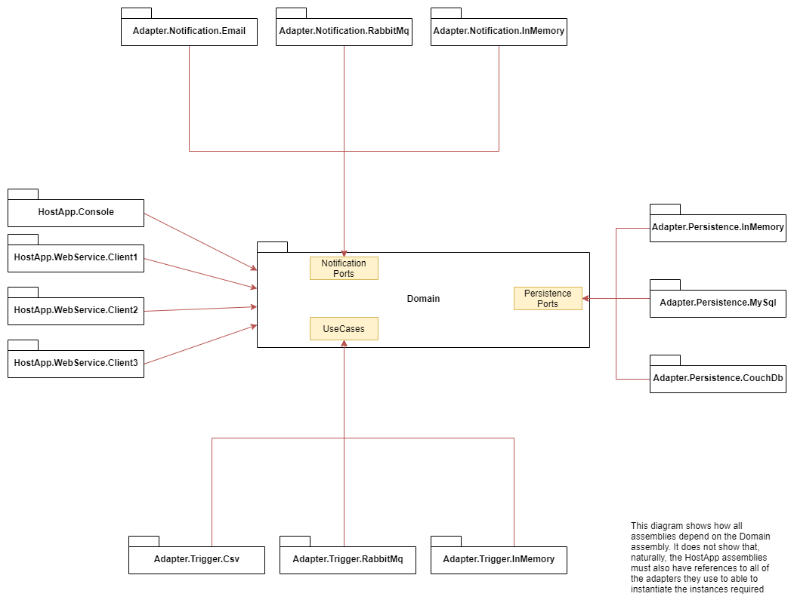

# Ports and Adapters - Example 01

This example uses a book order service as the domain, and the use cases that are implemented are ;

* Allow users to submit book title order requests from a supplier which are aggregated into a single book order for that supplier
* Allow users to approve or reject a book order 
* Allow users to send a book order to a supplier for purchase and shipping

The main work flow consists of book title orders being submitted, at some point a book order is approved and then the book order is sent to the supplier.

Multiple customers want to run the book ordering service but each has a slightly different configuration requirements

### Client 1 ###

* wants to use a REST endpoint to allow their client applications to submit book title orders
* wants to use a REST endpoint to allow their client applications to approve book title orders
* wants to use a REST endpoint to allow their client applications to send book title orders
* wants to use email to notify their book wholesaler of their orders when sending
* wants to store their state in a MySql relational database

### Client 2 ###

* wants to use a message queue (RabbitMq) to allow their client applications to submit book title orders
* wants to use a REST endpoint to allow their client applications to approve book title orders
* wants to use a REST endpoint to allow their client applications to send book title orders
* wants to use a message queue (RabbitMq) to notify their book wholesaler of their orders when sending
* wants to store their state in a MySql relational database

### Client 3 ###

* wants to poll a folder at regular intervals for a delimted file matching an expression and use the content to submit book title orders
* wants to use a REST endpoint to allow their client applications to approve book title orders
* wants to use a REST endpoint to allow their client applications to send book title orders
* wants to use a message queue (RabbitMq) to notify their book wholesaler of their orders when sending
* wants to store their state in a CouchDb document database

## Dependency Diagram
A diagram that depicts the overall references between the assemblies is below

## Testing ##
This repository also contains various examples of unit and integration testing.

I have deliberately moved away from using mocking frameworks in unit tests, especially for persistence interfaces, for the following reasons
* When you only have a single real implementation, such as only using SQL Server, then maintaining an in memory implementation for each interface makes it easier to see where you might be leaking persistence details into your domain.
* In memory implementations are useful for driving the application when iterating locally. For this reason I will quite often have configuration that allows me to bootstrap the application when deployed with the in memory implementations.
* Mocking frameworks are too forgiving in the face of signature changes and will often keep a unit test passing where it should be failing.   
  By having another implementation to maintain it means when you change interface contracts you are more likely to be forced to update the tests correctly.
* Using in memory implementations forces your tests to become more "data driven" as you have to populate them first in a sane manner rather than setting up mock expectations with arcane syntax requirements
  
